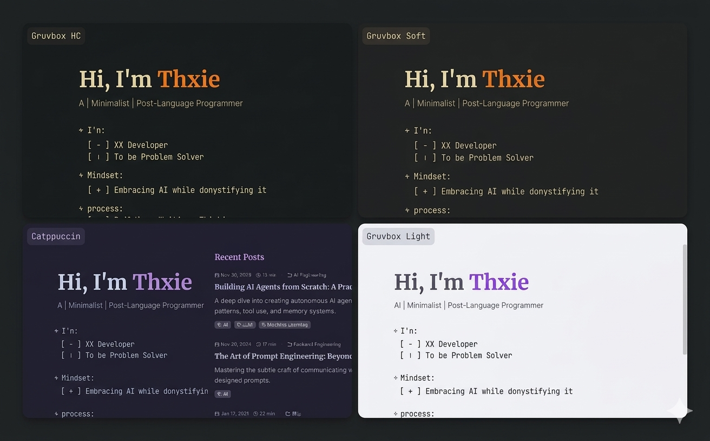
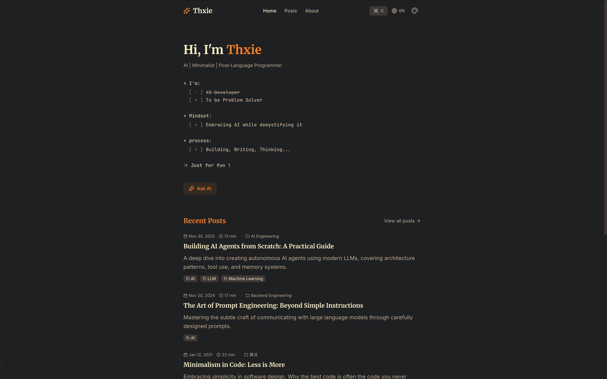

<div align="center">

# GruvBlog

A Gruvbox-first, minimal, fast, and beautiful developer blog with multi-theme support.

English | [简体中文](./README.zh-CN.md)

[](https://nextjs.org/)
[](https://tailwindcss.com/)
[](https://www.typescriptlang.org/)
[](LICENSE)

[Preview](https://thxie.com) · [Documentation](#configuration) · [Report Bug](https://github.com/ThxieX/gruvblog/issues)

</div>

<br />

<table>
  <tr>
    <td align="center" width="50%">
      
      <br />
      <sub>Themes</sub>
    </td>
    <td align="center" width="50%">
      
      <br />
      <sub>Preview</sub>
    </td>
  </tr>
</table>

---

## ✨ Features

- ⚡️ **Blazing Fast** — Static generation with zero runtime Markdown parsing (fast, SEO-friendly)
- 🎨 **Multi-theme** — Gruvbox (Light/Dark/Soft/High Contrast) + Catppuccin
- 🌍 **i18n Ready** — English, Chinese, Japanese out of the box
- 💬 **Comments** — GitHub Discussions powered by Giscus
- 🤖 **AI Chat** — RAG-powered assistant built on Cloudflare AI Search (optional)
- 📡 **RSS Feed** — Auto-generated feed for subscribers
- 🔍 **SEO Optimized** — Dynamic sitemap, robots.txt, Open Graph

## 🛠 Tech Stack

| Category | Technology |
|----------|------------|
| Framework | [Next.js 16](https://nextjs.org/) (App Router, SSG) |
| Styling | [Tailwind CSS 4](https://tailwindcss.com/) |
| UI Components | [shadcn/ui](https://ui.shadcn.com/) |
| Comments | [Giscus](https://giscus.app/) |
| AI | [Cloudflare AI Search](https://developers.cloudflare.com/ai-search/) (AutoRAG) |
| Language | [TypeScript 5.7](https://www.typescriptlang.org/) |

## 🚀 Quick Start

### Prerequisites

- Node.js 20+
- pnpm (recommended) / npm / yarn

### Installation

```bash
# Clone the repository
git clone https://github.com/ThxieX/gruvblog.git
cd gruvblog

# Install dependencies
pnpm install

# Start development server
pnpm dev
```

Open [http://localhost:3000](http://localhost:3000) to see your blog.

## ⚙️ Configuration

### Site Config (Core)

Edit `lib/config/site.config.ts` — this is the **only file** you need to modify:

```typescript
export const siteConfig: Config = {
  author: {
    name: 'Your Name',
    email: 'your@email.com',
    github: 'https://github.com/yourusername',
    twitter: 'https://twitter.com/yourusername',
  },
  site: {
    title: 'Your Blog Title',
    description: 'Your site description',
    url: 'https://yourdomain.com',
    locale: 'en_US', // Default locale (e.g., en_US, zh_CN, ja_JP)
    keywords: ['tech', 'programming', 'tutorial'], // SEO keywords 
    footerText: '© 2026 · Your Name · All rights reserved.', // Custom footer text  
  },
  
  // Comments (Optional) - Get values from https://giscus.app
  comments: {
    enabled: true,
    repo: 'yourusername/your-repo',
    repoId: 'YOUR_REPO_ID',
    category: 'Comments',
    categoryId: 'YOUR_CATEGORY_ID',
  },
}
```

### AI Assistant (Optional)

> You can choose not to enable this feature or use a different integration. 
> 
> This project uses [Cloudflare AI Search](https://developers.cloudflare.com/ai-search/usage/) (Beta).

Enable RAG-powered AI chat via Cloudflare AI Search with your preferred integration:

- Workers Binding
- REST API
- Public Endpoint

For example, Public Endpoint:
```bash
# Environment variable for Cloudflare AI Search endpoint
NEXT_PUBLIC_CLOUDFLARE_AI_SEARCH_URL=https://<INSTANCE_ID>.search.ai.cloudflare.com
```

Supported data sources:
- **R2 Bucket**: Connect a Cloudflare R2 bucket to index stored documents.
- **Website**: Connect your domain to enable website page indexing.

> This project auto-generates `/robots.txt` and `/sitemap.xml` at build time, suitable for standard Website crawling.
>
> See: [Cloudflare Docs#how-website-crawling-works](https://developers.cloudflare.com/ai-search/configuration/data-source/website/#how-website-crawling-works)


## 📝 Writing Posts

### Content Structure

```
--- Original posts (markdown) ---
content/posts/
├── 2024-01-15-my-post.md          # Single file (no images)
└── 2024-01-15-my-post/            # Directory (with images)
    ├── index.md
    └── diagram.png
```

### Frontmatter Format


```yaml
---
title: Article Title
date: 2024-01-15 
categories:  # Hierarchical parent → child (less is better, less > more, 1 > 2)
  - Tech
  - AI
tags:
  - machine-learning
  - tutorial
excerpt: "TL;DR - One-line summary for previews"
aiSummary: "AI-generated summary"
---
```

### Workflow

```bash
# 1. Create your post
vim content/posts/2024-03-26-new-post.md

# 2. Preview locally
pnpm dev

# 3. Deploy (auto-builds on push)
git add content/posts/
git commit -m "Add new post"
git push
```

### Build Pipeline (Fully automatic)
```
content/posts/
├── post.md                 ─┐
└── post-with-img/           │  [pnpm build]
    ├── index.md             │
    └── *.png  ──────────────┼──────────────→  public/images/posts/*/
                             │
                             │ (Fully automatic)
                             │
                             ▼
                  lib/generated/
                  ├── index.ts        (metadata index)
                  └── posts/*.ts      (content per post)
                             │
                             ▼
                  Static HTML (SSG) → CDN
                  
```


## 🌐 Deployment

### Vercel (Recommended)

> Deploy to Vercel with one click

[](https://vercel.com/new/clone?repository-url=https://github.com/ThxieX/gruvblog)

### Manual Build

```bash
# Build for production
pnpm build

# Start production server
pnpm start
```

## 🗺 Roadmap

- [x] Multi-theme support (Gruvbox + Catppuccin)
- [x] Internationalization (i18n)
- [x] GitHub-powered comments
- [x] AI chat assistant
- [x] RSS feed generation
- [ ] Full-text search
- [ ] Newsletter subscription
- [ ] Post analytics dashboard

## 🤝 Contributing

Contributions are welcome! Please feel free to submit a Pull Request.

## 📄 License

This project is licensed under the MIT License - see the [LICENSE](LICENSE) file for details.


<a href="https://v0.app/chat/api/kiro/clone/ThxieX/gruvblog" alt="Open in Kiro"></a>
---

<div align="center">

**[⬆ Back to Top](#GruvBlog)**

Made with ❤️ by [Thxie](https://github.com/ThxieX)

</div>
