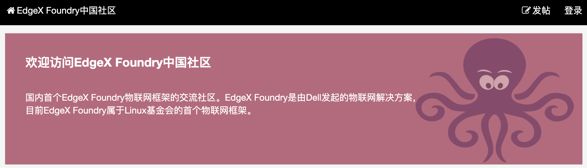

# Example Post with Images

This post demonstrates how to include local images in your markdown files.

## Using Local Images

When you create a post as a directory (like this one), you can place images alongside your `index.md` file:

```
content/posts/1971-01-01-example-with-images/
  index.md          <- This file
  diagram.png       <- Your images
  screenshot.png
```

Then reference them with relative paths:

```markdown

```

## How It Works

During build time, the script will:

1. Copy images to `/public/images/posts/[slug]/`
2. Rewrite `./image.png` to `/images/posts/[slug]/image.png`

This keeps your content organized while ensuring images work in production.

## External Images

You can also use external URLs directly:

```markdown

```

No special handling needed for external images.

---

## Semantic Typography Demo

This section demonstrates all the semantic styling elements available in our markdown renderer.

### Text Emphasis Styles

Here is some **bold text** and here is *italic text using muted color*. You can also combine **bold and *italic* together** for extra emphasis.

Here is some `inline code` with a subtle background.

### Heading Hierarchy Demo

#### H4: Section with Accent Color
This is a fourth-level heading, perfect for minor sections.

##### H5: Fine Divisions
Fifth-level headings are great for detailed breakdowns.

###### H6: Lowest Level
The smallest heading, nearly matching body text size.

### Links and Interactivity

Check out [this link to Google](https://google.com) which uses the primary theme color with a hover effect.

### Blockquotes

> This is a blockquote with a subtle background and left border.
> It uses muted text color for a softer appearance.
>
> Perfect for highlighting important quotes or notes.

### Lists

Unordered list with colored markers:
- First item with primary colored bullet
- Second item
- Third item with nested content

Ordered list:
1. First numbered item
2. Second numbered item
3. Third numbered item

### Code Blocks

```typescript
// TypeScript code block example
interface Theme {
  name: string;
  colors: {
    primary: string;
    secondary: string;
  };
}

const gruvbox: Theme = {
  name: 'Gruvbox',
  colors: {
    primary: '#fe8019',
    secondary: '#504945',
  },
};
```

### Horizontal Rule

The divider below uses a gradient fade effect:

---

This creates a professional, polished appearance.

## test

**my avatar**


hello 


